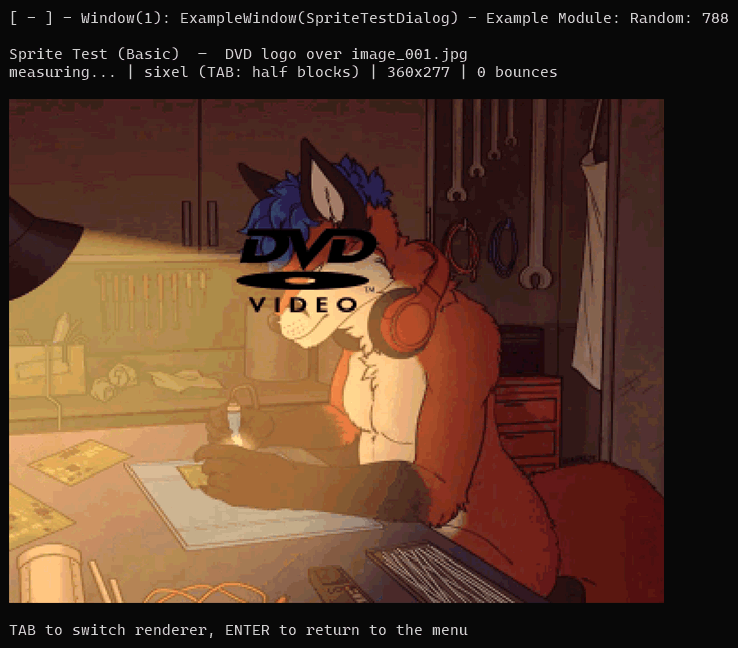
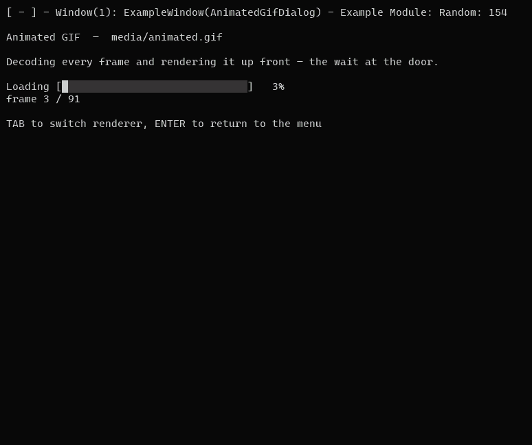
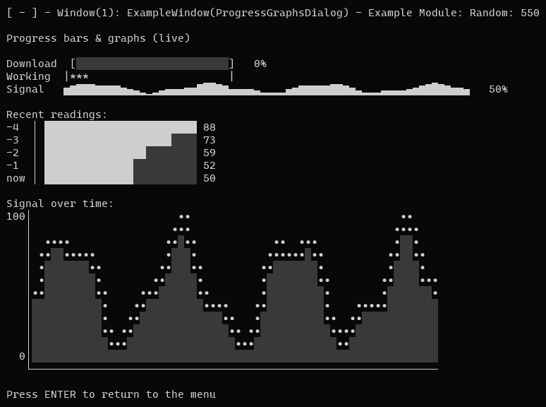

# Wolf Curses

**Build text user interfaces in C#.** You describe what the screen should look like; the library works out the smallest set of changes and draws it, flicker-free.


Windows and forms, menus, dialogs, file pickers, progress bars and graphs, plus images, sprites and animation, drawn in the terminal with real pixels where the terminal supports them.

**Zero dependencies.** PNG, JPEG and GIF decoding included.



*Yes, that is a photograph in a terminal, at ~30 fps. Sixel where the terminal speaks it, half blocks everywhere else, detected automatically.*

## Install

```cmd
dotnet add package WolfCurses
```

Requires the [.NET 10 SDK](https://dotnet.microsoft.com/download). [NuGet gallery page.](https://www.nuget.org/packages/WolfCurses/)

## Quick start

A complete program with a menu, a dialog, and the loop that drives it:

```csharp
using System.Threading;
using WolfCurses;
using WolfCurses.Controls;
using WolfCurses.Utility;
using WolfCurses.Window;

// Each enum value becomes a numbered menu choice; the description is the line the user reads.
public enum MainMenu
{
    [Description("Say hello")] Hello = 1,
    [Description("Quit")] Quit = 2
}

// Per-window state, yours to fill in.
public sealed class MainData : WindowData { }

// A window is a screen. Commands are wired to methods.
public sealed class MainWindow : Window<MainMenu, MainData>
{
    public MainWindow(SimulationApp simUnit) : base(simUnit) { }

    public override void OnWindowPostCreate()
    {
        AddCommand(() => MessageBox.Show(SimUnit, "Hello from WolfCurses!"), MainMenu.Hello);
        AddCommand(() => SimUnit.Destroy(), MainMenu.Quit);
    }
}

public sealed class MyApp : SimulationApp
{
    public static MyApp Instance { get; private set; }
    public static void Create() => Instance = new MyApp();

    protected override void OnFirstTick() => Restart();
    protected override void OnPreDestroy() => Instance = null;
    public override string OnPreRender() => "My App";

    public override void Restart()
    {
        base.Restart();
        WindowManager.Add(typeof(MainWindow));
    }
}

internal static class Program
{
    private static void Main()
    {
        MyApp.Create();
        while (MyApp.Instance != null)
        {
            MyApp.Instance.OnTick(true);   // reads input, ticks logic, redraws what changed
            Thread.Sleep(1);
        }
    }
}
```

That is the whole setup. You don't register windows, read keys, or draw frames. The library discovers `MainWindow`, drains the keyboard each tick, and presents changed rows itself.

Menus are steerable with the arrow keys as well as by typing a number, and typed input always wins. Up and Down walk the items in numbered order and roll over at the ends; when a menu is too tall for the terminal it reflows into columns, and Left and Right cross between them.

## See it running

Three example apps live in this repo, each with its own README:

- **[The library tour](example/WolfCurses.Demo/README.md)**: images, sprites, widgets, colour, and every dialog.
- **[The office suite](example/WolfCurses.Apps/README.md)**: small productivity applications. A word processor after the MS-DOS Editor, a BASIC environment after the one that shipped with DOS, a spreadsheet with formulas and charts, a desk calculator with a paper tape, and a calendar with a clock in it.
- **[The arcade](example/WolfCurses.Games/README.md)**: ten games, each built on a different part of the library. Snake, Minesweeper, Tetris, WolfChess 5000, Missile Command, Labyrinth, Pac-Man, Blackjack, Poker and Battlezone.

```cmd
dotnet run --project example/WolfCurses.Demo
dotnet run --project example/WolfCurses.Games
dotnet run --project example/WolfCurses.Apps
```

All three are terminal UIs, so run them from a real terminal window and give it some room. Between them they cover both input styles, every pacing model, styled output, generated and decoded graphics, scrolling, and falling back to characters where a terminal can't show a picture.

Prebuilt, self-contained downloads for Windows, macOS and Linux are on the [releases page](https://github.com/Maxwolf/WolfCurses/releases), all of them in a single archive with no .NET install needed.

## Images in the terminal

Images become a block of text and color escapes that you drop into your window's output like any other string.



*An animated GIF playing on loop: decoded, pre-rendered, then played back at the speed the file asks for.*

```csharp
using WolfCurses.Graphics;

// Once at startup, so the terminal interprets escapes and shows block glyphs:
AnsiConsole.Enable();

// Decode and render ONCE, then cache. A window renders every tick, and you
// don't want to re-decode a picture a thousand times a second:
private readonly string _logo = AnsiImage.RenderFile("media/logo.png");

public override string OnRenderWindow() => _logo;
```

- **Fits automatically.** Scaled to the console window, aspect preserved. `AnsiImageOptions.Fit` gives you the CSS `object-fit` modes (`Contain`, `Cover`, `Stretch`, `ScaleDown`).
- **Real pixels where possible.** Sixel and kitty are detected and used automatically; half blocks (`▀`, two pixels per cell) everywhere else.
- **Color degrades gracefully.** True color → 256 colors → grayscale → shaded ASCII, honoring `NO_COLOR`.
- **Transparency works**, and `background.Overlay(foreground)` alpha-composites two images into one.
- **Missing textures look missing.** A broken path or corrupt file becomes the magenta-and-black checkerboard you know from game engines instead of throwing, because in a text UI a stack trace lands on top of your interface. The reason is in `AnsiImage.Error`.
- **Draw your own.** `Fill`, `DrawLine` and `DrawDisc` on a `PixelBuffer`. The rule: **`Fill` paints, every `Draw` composites.**
- **Decoders are swappable.** Implement `IImageDecoder` (one method) and assign `ImageDecoders.Default`.

<details>
<summary>What the built-in decoders cover</summary>

| | Covered | Not covered |
|---|---|---|
| **PNG** | Every colour type, every bit depth 1 to 16, transparency in all three forms, Adam7 interlacing | None |
| **JPEG** | Baseline, extended sequential, and **progressive**; any sampling factors; restart markers; greyscale | Arithmetic coding, lossless and hierarchical modes, CMYK/YCCK |
| **GIF** | 87a and 89a, interlacing, transparency, local colour tables, animation (`GifDecoder.DecodeFrames`) | None |

Unsupported input fails with a message naming the format and the seam, not with garbage pixels. The decoders are checked against [StbImageSharp](https://github.com/StbSharp/StbImageSharp) on real files in the test suite. That is an independent implementation reading the same bytes, and the cheap way to catch a misread spec.

</details>

<details>
<summary>Choosing the renderer yourself</summary>

Detection runs once, when your `SimulationApp` is constructed. It asks the terminal directly and falls back to environment variables when there's nothing to ask. It is deliberately biased toward half blocks: **guessing wrong the safe way costs picture quality; guessing wrong the other way fills the screen with escape sequences.** tmux and screen report as half blocks, since they rewrite escapes.

```csharp
// Overrule detection. A renderer you assign always wins:
ImageRenderers.Default = new SixelImageRenderer();

// ...or draw one picture differently, without touching the global default:
var photo = image.ToAnsi(options, new KittyImageRenderer());
```

- **`HalfBlockImageRenderer`**: the fallback; works in any terminal that can do color.
- **`SixelImageRenderer`**: xterm (built with sixel), foot, WezTerm, mlterm, contour, recent Konsole and VTE, iTerm2, Windows Terminal 1.22+.
- **`KittyImageRenderer`**: kitty, WezTerm, Ghostty. Full 24-bit color and real alpha, so it wins where both are available.

The demo app's **Force render type** menu item redraws everything with each one in turn, so you can see what your terminal actually does.

</details>

## Sprites, animation and collision

When the thing on top *moves*, a `SpriteScene` holds the background as pixels and recomposes as often as you like.

```csharp
var scene = new SpriteScene(background);
scene.Sprites.Add(new Sprite(pixels, x, y));

string frame = scene.ToAnsi(options);        // each frame
sprite.Image = nextGifFrame;                 // that's all animation takes
var hits = scene.SpritesTouching(sprite);    // which sprites it ran into
```

Sprites draw in order (last is nearest), are clipped rather than refused so they can walk in from off-screen, and honor their own transparency.

> **The one knob worth knowing:** the scene is the size of its background. Resize the background once to roughly what the terminal can show and a frame costs a fraction of what it costs at a photograph's native resolution.

The [three sprite demos](example/WolfCurses.Demo/README.md#sprites) cover the lot: a bouncing logo, five animated GIFs flying through one another while being added and removed, and two penguins you steer together to watch collision fire.

## Widgets

Drop-in display widgets that turn data into text you return from your render. No windows to register: they're pure string producers, so they compose with everything else.



*`ProgressBar`, `MarqueeBar`, `Sparkline`, `BarChart` and `LineGraph` animating together. Every one of them is just a string returned from the form's render.*

```csharp
using WolfCurses.Window.Control;

var bar = new ProgressBar { Width = 24, Label = "Download" };
string line = bar.Render(bytesDone, bytesTotal);   // Download [██████████░░░░░░]  42%

string trend = new Sparkline().Render(samples);    // ▁▂▄▅▇█▆▄▂
string graph = new LineGraph { Width = 40, Height = 10 }.Render(samples);
string chart = new BarChart { Width = 20 }.Render(new[]
{
    new BarChartValue("Wood", 12),
    new BarChartValue("Iron", 5),
});
```

- **`ProgressBar`**: determinate, with configurable glyphs, brackets, percentage and label. `MarqueeBar` and `SpinningPixel` cover the indeterminate case.
- **`Sparkline`**: a series as one line of block glyphs, auto-scaled.
- **`BarChart`**: labelled horizontal bars, aligned to a common width.
- **`LineGraph`**: a 2-D plot with optional axes, scale labels and area fill.
- **`TextGrid`**: a rectangle of characters, each with its own style: boards, maps, playfields. `Render(x, y, columns, rows)` is a **window onto the grid**, so a world larger than the screen just scrolls, and `CenterOrigin` is the camera.
- **`BoxDrawing`**: picks the box-drawing character joining lines in a given set of directions. A rectangle knows its six glyphs up front; a *network* of lines (a maze, a table with interior rules, a wiring diagram) has sixteen answers and has to decide each cell from its neighbours.

Every widget takes colors and ramps, and anything you leave alone emits no escapes at all, so a plain build stays byte-for-byte plain.

## Dialogs, panels and pickers

Ready-made modals that push themselves on top of the current screen, take over input, and call you back before closing themselves.

```csharp
using WolfCurses.Controls;
using WolfCurses.Window.Control;

// A bordered panel (a pure string widget, no window needed):
string panel = new Box { Title = "Status", Border = BoxBorderEnum.Double, Padding = 1 }
    .Render("All systems nominal.");

SelectList.Choose(SimUnit, "Pick a color", new[] { "Crimson", "Emerald", "Sapphire" },
    onChosen: index => { /* ... */ });

MessageBox.Confirm(SimUnit, "Enable hard mode?", onYes: () => { /* ... */ });

TextInputDialog.Prompt(SimUnit, "What is your name?",
    onSubmit: name => { /* ... */ },
    defaultValue: "Traveler",
    validator: v => v.Length < 2 ? "Name must be at least 2 characters." : null);

FileDialog.OpenFile(SimUnit, startDirectory: "C:\\", extensions: new[] { ".jpg", ".png" },
    onFileSelected: path => { /* ... */ });
```

- **`Box`**: a border (single, double, rounded, ASCII or none) around any text, with optional title and padding. Widths ignore ANSI escapes, so it frames colored text and even images correctly.
- **`SelectList`**: a paginated picker; `Choose` for one, `ChooseMany` for several.
- **`MessageBox`**: `Show`, `Confirm`, or yes/no/cancel.
- **`TextInputDialog`**: a line of text, with a default, validation and optional password masking.
- **`FileDialog`**: browse drives and folders to pick a file or a directory.

All of them ship inside the library and are discovered automatically. (If you override `AllowedWindows` to curate your window list, include the ones you use.)

## Editable documents

`WolfCurses.Documents` is what an editor-shaped screen would otherwise start by writing. The input buffer is append-only with no caret, which is right for a command prompt and useless for anything you can move around inside.

- **`TextBuffer`** holds the lines, the caret and the selection. Vertical movement remembers the column it started in, so walking down through a short line and back does not drag the caret in with it. The file's line ending is remembered rather than normalized, so opening a file and saving it untouched gives back the same bytes.
- **`TextViewport`** is the scrolling window onto it: `EnsureVisible` scrolls the least it can and reports whether it moved, `ToDocument` turns a click into a position, and `TryToScreen` says when a position is not on screen at all.
- **`TabStops`** translates between where a character is stored and where it is drawn. A tab advances to the next stop; it is not a fixed number of spaces, and treating it as one misaligns every table from its second row on.
- **`TextWords`** walks the words of a document and counts them, using the same idea of a word as the cursor keys, or one you supply.
- **`TextSearch`** finds things, forwards or backwards, wrapping round the ends. Forward means "at or after" and backward means "strictly before", which is what stops a Find Next key from landing on the same match every time it is pressed.
- **`DelimitedText`** reads and writes CSV, and the other delimiters that share its rules. Everybody writes this as `line.Split(',')`, which is correct on the file you tested it against and wrong on the first real one: a field may be quoted, and a quoted field may contain the delimiter, a quote, or a line break. That last one is not a bug in a line splitter so much as proof that splitting into lines first cannot work at all, which is why this takes the whole text. Reading is lenient and never throws, because a parser for somebody else's export has no useful way to refuse.
- **`DelimitedColumns`** is the half of that everybody writes next, and gets wrong: reading a field back out. Written as `row[3]` it is correct against the file it was tested on and silently wrong the moment somebody moves a column, adds one, or hand-edits a row so it is a field short. Give it the header row and ask by name. A column the file has not got and a row that stops before reaching one both read as empty, which are exactly the two shapes an edited file arrives in and the two the index-based version gets wrong in different ways. Column names are matched without case and with the ends trimmed where the data is neither, because a header cell is a *name* and a data cell is a *value*.
- **`ControlPictures`** is the other half of that translation and the half that is easy to miss. A terminal does not *draw* a control character, it obeys it: a form feed, which text files have used as a page break for fifty years, moves the cursor down a row part way through writing one, and everything after it lands on the line below. Substituting one visible character for one keeps every column, caret and hit test exactly where it was. It applies to drawing only, so a page break still survives being opened and saved again.

`MenuBar` and `ScrollBar` are the pull-down bar across the top and the bar down the side, both of which keep their layout so that what is drawn and what a click lands on cannot disagree. The menu bar answers the pointer three ways: a press opens or chooses, and a *move* walks the highlight through an open panel or slides along the bar opening each menu in turn. Hovering a shut bar deliberately opens nothing. An entry can say for itself when it means anything (`EnabledWhen`), and one that does not is drawn greyed as well as being inert, so a menu that refuses you looks like it is refusing you.

Two more pieces sit alongside them, for the screens that are a table rather than a document:

- **`TableViewport`** is `TextViewport` for a grid whose columns are not all one wide. Every sum in it would be a multiplication if they were, and each one is the sum somebody writes inline, gets right for the fixed-width case, and finds is wrong the first time a column is widened. It answers which columns fit, where one is drawn, which one a click landed in, and how far right you may scroll before the last column stops moving.
- **`TextRow`** builds a row out of styled runs and can then draw *a range of its columns*. That is what anything drawing a panel, a tooltip or a pointer over the screen behind it needs, and it cannot be done to a finished styled string: twenty columns of coloured text is several hundred characters long, so cutting by column lands inside an escape sequence and spills the rest into the terminal as text. Keep the row as plain runs, resolve the colour at the moment of drawing, and slicing is ordinary arithmetic. Adjacent runs coalesce on the escape they resolve to, and a row nobody coloured comes out byte-for-byte plain.

- **`Keypad`** is a grid of labelled, clickable cells: a calculator's keys, a dialog's buttons, a game's on-screen controls. Same principle again, because its keys are not all one width: the layout is worked out once and read by both the drawing and the hit test. Spanning keys get their box-drawing junctions right on their own, since each is chosen from the lines that actually meet it.

- **`MonthGrid`** is a month laid out as a calendar: six week rows always, today and a selected day picked out, and whichever days have something on them marked by a predicate. Same principle a third time, because a calendar's whole difficulty is off-by-one. Today is *told* rather than read from the clock, so it can be tested and so a program left open past midnight moves its own highlight.

- **`FieldList`** is a record drawn as labelled fields: the properties panel, the settings page, the card in a card index. Same principle a fourth time, and here it is not a nicety, because **a field is not a row**. A value long enough to wrap, or one given room for a note, takes up several, so the field on screen row four is not the fourth field and the hit test everybody writes first is wrong for everything below the first field that wraps. Every row of a field answers with that field, so clicking the third line of a note picks the note. The label column is measured once for the whole list rather than per field, and a value too long for the rows it was given says so instead of stopping mid-word.

- **`Timeline`** is a position along something with a length, drawn as a bar you can click: the transport under a video, the scrubber under a piece of audio, a long job with an end in sight. Same principle a fifth time. Its own off-by-one is at the right-hand end - the *last* column is the whole duration, so the scale divides by one less than the width, and getting that wrong means the last second of a film is somewhere the pointer cannot reach. An unknown length draws a track with no playhead and refuses to be seeked, because seeking a live stream to forty percent of nothing means nothing.

- **`ColumnChart`** is bars standing up from a baseline: a level meter, a spectrum, a histogram. The vertical counterpart of `BarChart` and the fourth of the data widgets. It is `Sparkline` with a height, and what the height brings is the arithmetic everybody gets wrong: **a value that is small but not nothing still has to draw something**, or a meter reads as switched off when it is merely quiet, and telling those two apart is the only thing a meter is for.

`AnsiText.Fit` is the smallest version of the same problem: pad or trim text to an exact number of *visible* columns. `PadRight` pads a coloured cell to nothing and `Substring` cuts an escape in half; this measures with the same walk `VisibleLength` uses and carries every escape through a trim, including the reset that fell past the cut. `AnsiText.Slice` generalizes it to any range, which is how you draw something over a row a widget has already styled.

## Input

- **Keys arrive as you'd expect.** ENTER submits the typed command, BACKSPACE edits it, everything else both fills the prompt and reaches the focused form.
- **Mouse is opt-in.** `AnsiConsole.EnableMouse()` and presses start arriving as `OnMousePressed(MouseEvent)` with the cell that was clicked. Releases, moves and wheel notches arrive as `OnMouseEvent(MouseEvent)`, which is what click-and-drag, a pointer you draw yourself and scrolling are built from; motion is a further opt-in (`InputManager.ReportsMouseMotion`) because it is one event per cell the pointer crosses. The wheel is its own event kind rather than a button, so nothing that acts on a click can be triggered by a scroll. **Windows only for now**; elsewhere it returns false having written nothing, so nothing changes.
- **`PlaybackClock`** is where you are in something that has a length - a video, an animation, a recording being replayed. It survives being paused and can be put somewhere else without being restarted, and **it is deliberately the opposite of `IntervalTimer`**: that one drops a late period on purpose, because repaying the debt is a sprite teleporting; this one never drops anything, because a frame's time is a fact about the media rather than about how often you asked. Falling behind means skipping frames to catch up, not slowing the film down. `FrameAt(fps)` is the frame that belongs on screen now, which is what makes catching up a `while` loop rather than a decision.

- **`HeldAxis`** solves a problem every real-time terminal app hits: a terminal never reports a key being *let go*, so a held key arrives as a burst of presses. Feed it `Press(-1)` and read `Direction`; it infers the key-up from silence.

## Building from source

```cmd
git clone https://github.com/Maxwolf/WolfCurses.git
dotnet build WolfCurses.sln
dotnet test
```

Fork it and use it as the base for your next application, or just cherry-pick from it.

## Where it came from

This project re-creates the idea behind [curses](https://en.wikipedia.org/wiki/Curses_(programming_library)), the library Ken Arnold originally released with BSD UNIX and which [Rogue](https://en.wikipedia.org/wiki/Rogue_(video_game)) made famous, for a modern object-oriented language and without wrapping a native library.

<details>
<summary>A little more about curses</summary>

Curses was designed to give GUI-like functionality on a text-only device: a PC in console mode, a hardware ANSI terminal, a Telnet or SSH session. Curses-based programs often have an interface resembling a graphical one, with widgets like text boxes and scrollable lists, rather than the command-line style usually found on text-only devices. That can make them friendlier than a CLI while still running anywhere, including pre-1990 machines and modern embedded systems with text-only displays.

Not all of it looks like a GUI, though. vi is the counterexample: not command-line based, but driven almost entirely by memorized keystrokes rather than the prompting style that relies on recognition over recall.

Several projects followed the original: pcurses, PDCurses, and more recently ncurses, still used by most Linux text-mode installers. This project isn't affiliated with any of them.

</details>
